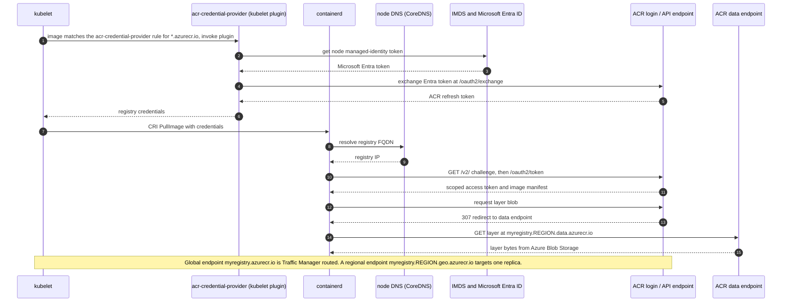
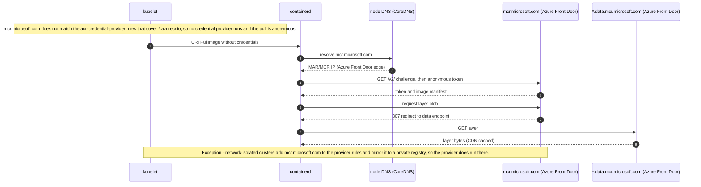

# AKS → ACR connectivity chaos testing with Azure Chaos Studio

Test AKS image-pull resilience for Azure Container Registry and Microsoft Artifact Registry.

   

## Why

Every AKS rollout, scale-out event, and node recovery depends on the image-pull path from kubelet and containerd to a registry. DNS failures, network latency, authentication drift, registry throttling, or upstream outages can leave pods in `ImagePullBackOff`, delaying application startup and recovery.

Many teams validate compute and application failover but do not regularly test registry connectivity until a production incident exposes the dependency. This sample creates a disposable AKS + Premium geo-replicated Azure Container Registry (ACR) environment and uses Azure Chaos Studio plus ACR-native controls to inject safe, repeatable image-pull failures.

Running these experiments with Azure Chaos Studio helps you uncover the fault domains in your AKS deployments — the DNS, network, identity, throttling, and routing dependencies behind every image pull — so you can validate graceful degradation and recovery, and harden the path before a production incident exposes it.

## What you can and cannot test

### ✅ Supported

| Scenario | Mechanism | Status | Experiments |
|---|---|---|---|
| Registry DNS failure (AKS→ACR and AKS→MAR) | AKS Chaos Mesh DNS fault | Verified end-to-end | [A2](reports/a2-dns-failure.md) |
| Registry network latency | AKS Chaos Mesh network delay | Verified end-to-end | [A3](reports/a3-network-latency.md) |
| Data-endpoint-only outage (auth and manifest stay up, blob download blocked) | AKS Chaos Mesh DNS fault on the data-endpoint FQDN | Verified end-to-end | [A4](reports/a4-data-endpoint.md) |
| Registry unreachable / network block | NSG deny rule to registry **CIDR ranges** | Supported | [A1](reports/a1-nsg-block.md) |
| Cached image keeps running during a registry outage | Already-pulled images | Supported | [A1](reports/a1-nsg-block.md) |
| Auth change breaks pulls (RBAC→ABAC mode flip) | ACR role-assignment-mode + role grant | Verified | [B2](reports/b2-abac-flip.md) |
| Geo-replica removed from global routing | ACR-native `--global-endpoint-routing` toggle; observe reroute | Verified | [C1a](reports/c1a-geo-failover.md) |
| AKS pulls a cached image from ACR while it cannot reach the upstream registry directly | ACR artifact cache rule (image already synced from upstream) | Verified | [F3](reports/f3-artifact-cache.md) |

### ⚙️ Supported with setup or at scale

| Scenario | Required setup | Notes | Experiments |
|---|---|---|---|
| Registry throttling (HTTP 429) / tenant fairness | Real pull-storm load | Premium limits are high; high concurrency is required. | [D1](reports/d1-throttling.md), [D2](reports/d2-tenant-fairness.md) |
| Private endpoint / private-DNS failure | Private endpoint + private DNS break | Disabling public access has no public fallback; a private endpoint + private DNS restore pulls over a private IP (verified). | [A5](reports/a5-private-endpoint.md) |
| CMK registry with ACR→Key Vault access severed | CMK-enabled deployment (`ENABLE_CMK=true`) | Verified — disabling the CMK vault's `AzureServices` trusted-services bypass and denying its firewall cuts ACR's Key Vault access, so AKS pulls fail `403 Forbidden`; the stock Deny-Access fault alone keeps the bypass and does not reproduce this. | [F1](reports/f1-cmk-keyvault.md) |
| AKS availability-zone loss | Zone-pinned node pool + VMSS Chaos target | Tests AKS-side recovery during pull activity. | [C2](reports/c2-az-loss.md) |
| Throttling while failing over between replicas | Exclude a replica from routing + pull load | Use a dedicated test registry because throttling is registry-wide. | [D3](reports/d3-throttle-failover.md) |
| Regional-endpoint pinning / client-side failover on AKS | Enable `--regional-endpoints`; supply pull credentials or use DNS-based routing | Direct regional FQDNs work, but default AKS managed credentials do not match them. | [C1b](reports/c1b-regional-failover.md) |

### ⛔ Not supported (platform constraints)

| Scenario | Why | Experiments |
|---|---|---|
| Faulting ACR itself (fail a replica, force a 429, drop a zone, trigger geo-failover) | Azure Chaos Studio has no `Microsoft.ContainerRegistry` fault provider; these platform-managed behaviors can only be observed. | [C1a](reports/c1a-geo-failover.md), [C1c](reports/c1c-health-probe-gap.md) |
| NSG security-rule fault with an Azure **service tag** destination (`AzureContainerRegistry`, `MicrosoftContainerRegistry`, or `AzureFrontDoor.FirstParty`) | Verified error: `Security rule parameter DestinationAddressPrefix ... cannot specify existing VIRTUALNETWORK, INTERNET, AZURELOADBALANCER, '*' or system tags. Unsupported value used`. This applies per tag to `AzureContainerRegistry`, `MicrosoftContainerRegistry`, and `AzureFrontDoor.FirstParty` because all are system tags. Use CIDR ranges, or apply service tags at an external firewall such as Azure Firewall. | [A1](reports/a1-nsg-block.md) |
| Agent-based faults such as IMDS block or node CPU/memory/disk pressure | The Chaos Studio agent VM extension is required on the node VMSS and is not supported on AKS-managed node pools; use service-direct AKS Chaos Mesh faults where available. | [B1](reports/b1-imds-loss.md), [D4](reports/d4-disk-pressure.md), [E1](reports/e1-node-pressure.md) |
| Blocking MAR/MCR by IP or service tag | `mcr.microsoft.com` is Azure Front Door-fronted with rotating IPs, so static IP blocking is unreliable; and the Chaos NSG fault rejects the `MicrosoftContainerRegistry` and `AzureFrontDoor.FirstParty` service tags (system tags, as verified in A1). Use DNS faults instead. | [F2](reports/f2-mar-edge.md) |
| Connected-registry offline | Requires an Azure Arc or IoT Edge host, which is outside an in-Azure AKS stack. | [F4](reports/f4-connected-registry.md) |

## Table of contents

- [How it works](#how-it-works)
- [Prerequisites](#prerequisites)
- [Quickstart](#quickstart)
- [How it works in depth](#how-it-works-in-depth)
- [Experiments](#experiments)
- [Limitations and scope](#limitations-and-scope)
- [Repository layout](#repository-layout)
- [Contributing](#contributing)
- [Support](#support)
- [Security](#security)
- [License](#license)
- [Trademarks](#trademarks)
- [References](#references)

## How it works

Azure Chaos Studio can fault resources for which it has a provider, such as AKS via Chaos Mesh, network security groups, Key Vault, and selected compute resources. It does not provide a `Microsoft.ContainerRegistry` fault provider. Registry resilience testing is therefore performed at the client edge, through real load, through registry dependencies, or through ACR-native operator actions.

| Injection mechanism | What it reaches | Example |
|---|---|---|
| Client-side Chaos Studio fault | AKS pod DNS/network path or subnet egress path to the registry | DNS-fail `myregistry.azurecr.io`, add latency, block registry CIDR ranges. |
| Load orchestration | Real registry limits under actual pull volume | Pull storm that produces genuine `429` responses. |
| Dependency fault | Azure dependency of an ACR feature | Sever ACR→Key Vault for a CMK-enabled registry by disabling the vault trusted-services bypass. |
| ACR-native operator action | Safe ACR control-plane behavior exposed to customers | Temporarily exclude a replica from global endpoint routing. |
| Observation only | Platform-managed behaviors without a customer-invocable trigger | ACR zone redundancy and service-managed geo-failover. |

## Prerequisites

- Azure subscription with permission to create AKS, ACR Premium, network security groups, Log Analytics, role assignments, and Azure Chaos Studio resources.
- Azure CLI with `az bicep`, plus `kubectl`, `helm`, `jq`, `make`, and Bash.
- Registered Azure resource providers for the deployed services, including `Microsoft.Chaos`.
- A region and VM SKU allowed by the subscription. Check availability before deployment:

```bash
az vm list-skus -l <region> --size <sku> -o table
```

## Quickstart

A2 (DNS failure) and A3 (network latency) are the fastest experiments to see working because they use AKS Chaos Mesh faults and do not require optional infrastructure.

```bash
cd /Users/johnsonshi/repos/aks-acr-chaos-studio

make preflight
make cycle RG=rg-acr-chaos LOCATION=<region> AKS_VM_SIZE=<sku>
make run EXP=acrchaos-a2-dns-failure

# Inspect the generated run output and the curated report index.
ls reports/

make reset
```

`make cycle` runs the deploy, Chaos target, and workload preparation steps. `make run` probes the baseline, starts the selected experiment, waits for `HOLD_MIN`, probes during the fault, cancels the experiment, collects Log Analytics queries, and records the run under `results/`.

See [GETTING-STARTED.md](GETTING-STARTED.md) for the full tutorial, including CI game-day setup with GitHub Actions OIDC.

## How it works in depth

### AKS → ACR pull path



Design points:

- On an AKS node, **kubelet resolves credentials and containerd performs the pull**. Because the image matches the `acr-credential-provider` rules (`*.azurecr.io` plus the sovereign-cloud suffixes `*.azurecr.us`, `*.azurecr.cn`, `*.azurecr.de`), kubelet invokes that plugin. The plugin uses the node managed identity (IMDS and Microsoft Entra ID) to obtain an ACR token and returns it to kubelet, which passes it to containerd on the CRI `PullImage` call.
- ACR pulls use a login/API endpoint for authentication, manifest discovery, and content discovery, then a data endpoint for blob download through a `307` redirect.
- The global endpoint (`myregistry.azurecr.io`) is routed by Azure-managed Traffic Manager DNS. Customers can observe routing behavior but cannot force a platform failover through Chaos Studio.
- Regional endpoints (`myregistry.<region>.geo.azurecr.io`) are directly addressable after `--regional-endpoints` is enabled; clients use them by referencing that FQDN directly and fail over by switching to a different regional FQDN. On default AKS, the managed `acr-credential-provider` matches `myregistry.azurecr.io` but not five-part regional names, so direct regional pulls need explicit pull credentials, DNS-based routing that keeps the global hostname, or node credential-provider customization.
- Dedicated data endpoints (`myregistry.<region>.data.azurecr.io`, Premium) keep layer download links regional; without them, data may flow through broad `*.blob.core.windows.net` endpoints.
- Credential caching can hide short auth-path faults until a token refresh is required.

### AKS → MAR / MCR pull path



Design points:

- On an AKS node, **containerd performs MAR/MCR pulls directly and the pull is anonymous by default**. `mcr.microsoft.com` does not match the `acr-credential-provider` rules (which cover `*.azurecr.io` and the sovereign-cloud suffixes), so kubelet invokes no credential provider for it.
- MAR/MCR uses `mcr.microsoft.com` and `*.data.mcr.microsoft.com`, fronted by Azure Front Door. Because those edges use rotating IPs, prefer DNS faults over static IP blocks.
- **Exception:** network-isolated AKS clusters add `mcr.microsoft.com` to the credential-provider rules and mirror it to a private registry, so in that configuration the credential provider does run and pulls are redirected to the private mirror.

### Steady-state signals

| Signal | Source |
|---|---|
| Pull success, failure, and duration | Kubernetes events (`Pulled`, `Failed`), kubelet/containerd logs, and `kubelet_image_pull_duration_seconds` where available. |
| Reachability | `az aks check-acr`, `az acr check-health`, and the included probe scripts. |
| Registry auth events | `ContainerRegistryLoginEvents` in Log Analytics. |
| Registry repository events | `ContainerRegistryRepositoryEvents` in Log Analytics. |
| Throttling | `429`, `Retry-After`, `TOOMANYREQUESTS`, and `CONNECTIVITY_TOOMANYREQUESTS_ERROR`. |
| Replica health and routing | `az acr replication list -o table`, Resource Health, and pull behavior through global or regional endpoints. |

`ContainerRegistryLoginEvents` and `ContainerRegistryRepositoryEvents` are customer-facing Azure Monitor resource logs. Enable them with the registry Diagnostic settings and route them to Log Analytics. Use `scripts/20-enable-acr-diagnostics.sh` to enable the categories and allow a few minutes for ingestion.

## Experiments

Status: ✅ Pass = supported and verified · ⚠️ Partial = works with caveats or only at higher scale · 🚫 Blocked = not supported here or needs opt-in infrastructure · 📄 Documented = design note.

Current coverage across 20 scenarios: **8 Pass · 6 Partial · 5 Blocked · 1 Documented**.

| ID | Scenario | Mechanism | Status | Notes |
|---|---|---|---|---|
| [A1](reports/a1-nsg-block.md) | Registry unreachable | NSG deny to registry CIDR ranges | ⚠️ Partial | Works with a caveat — a CIDR deny rule blocks registry egress, but the Chaos Studio NSG fault rejects Azure service tags/system tags (`AzureContainerRegistry`, `MicrosoftContainerRegistry`, `AzureFrontDoor.FirstParty`), so `infra/chaos.bicep` uses the `acrDenyCidrs` CIDR parameter; resolve registry IP ranges before running it because the default is inert TEST-NET space. |
| [A2](reports/a2-dns-failure.md) | Registry DNS failure | AKS Chaos Mesh DNS fault | ✅ Pass | Works — the AKS Chaos Mesh DNS fault makes registry name resolution fail on demand and recover on cancel. |
| [A3](reports/a3-network-latency.md) | Registry latency | AKS Chaos Mesh Network Chaos | ✅ Pass | Works — the AKS Chaos Mesh network fault adds measurable registry latency while non-targeted hosts stay unaffected and recovery occurs on cancel. |
| [A4](reports/a4-data-endpoint.md) | Data-endpoint-only outage | AKS Chaos Mesh DNS fault on the data-endpoint FQDN | ✅ Pass | Works — a DNS fault on only the data-endpoint FQDN keeps auth and manifest (login endpoint) healthy while the data endpoint that serves blob downloads goes unresolvable; recovers on cancel. |
| [A5](reports/a5-private-endpoint.md) | Private endpoint / private DNS | Disable public access + private endpoint/private DNS | ✅ Pass | Works — disabling public access makes AKS pulls fail 403 with no public fallback; a private endpoint + private DNS restore pulls over a private IP while public access stays off. |
| [B1](reports/b1-imds-loss.md) | IMDS / identity loss | Agent-based node network fault | 🚫 Blocked | Not testable via Chaos Studio here — IMDS blocking needs an agent-based node fault, unsupported on AKS-managed node pools. |
| [B2](reports/b2-abac-flip.md) | ABAC mode flip | ACR role-assignment-mode change + grant | ✅ Pass | Works — changing ACR to ABAC makes AcrPull fail with 401 until the repository role is granted. |
| [C1a](reports/c1a-geo-failover.md) | Geo-replica routing exclusion | ACR-native global endpoint routing toggle | ✅ Pass | Works — the ACR routing toggle excludes a replica from global-endpoint routing while the data plane remains available. |
| [C1b](reports/c1b-regional-failover.md) | Regional endpoint client-side failover | Regional endpoint direct FQDN pull + client-side failover | ⚠️ Partial | Works with a caveat — regional FQDNs work once `--regional-endpoints` is enabled, but default AKS credentials do not match them, so supply a pull secret or use DNS-based routing with the global hostname. |
| [C1c](reports/c1c-health-probe-gap.md) | Global endpoint health-aware failover | Documented platform behavior | 📄 Documented | Design note only — a health-aware global-endpoint failover cannot be injected client-side; Traffic Manager's health detection is service-side and is not triggered by 429. You can only mimic it by disabling an endpoint (covered by other tests). |
| [C2](reports/c2-az-loss.md) | AKS availability-zone loss | VMSS shutdown by zone | 🚫 Blocked | Not testable via Chaos Studio here — it needs a zone-pinned node pool and VMSS Chaos target not created by the default stack. |
| [D1](reports/d1-throttling.md) | Pull-storm throttling | Real pull load | ⚠️ Partial | Works with a caveat — pull-storm load is runnable, but this scale did not reach Premium throttling limits or produce 429s. |
| [D2](reports/d2-tenant-fairness.md) | Tenant fairness | Two-identity pull load | ⚠️ Partial | Works with a caveat — two-identity load is runnable and the victim stayed healthy, but no throttling occurred to prove fairness isolation. |
| [D3](reports/d3-throttle-failover.md) | Throttling while failing over between replicas | Exclude a replica from routing, then drive pull load | ⚠️ Partial | Works with a caveat — this drives pull load while the client fails over from one replica to another (a replica is excluded from routing); at this scale no 429s occurred, so throttling under failover was not observed. |
| [D4](reports/d4-disk-pressure.md) | Disk pressure / image GC | Agent-based disk pressure | 🚫 Blocked | Not testable via Chaos Studio here — disk pressure needs an agent-based node fault, unsupported on AKS-managed node pools. |
| [E1](reports/e1-node-pressure.md) | Node CPU/memory pressure | Agent-based node pressure | 🚫 Blocked | Not testable via Chaos Studio here — CPU and memory pressure need agent-based node faults, unsupported on AKS-managed node pools. |
| [F1](reports/f1-cmk-keyvault.md) | CMK registry with ACR→Key Vault access severed | Sever ACR->Key Vault (disable the CMK vault's trusted-services bypass) | ✅ Pass | Works — with a CMK registry, disabling the vault's AzureServices trusted-services bypass and denying its firewall cuts ACR's access to Key Vault, so ACR can't unwrap the CMK and AKS pulls fail 403; restoring vault access recovers pulls. |
| [F2](reports/f2-mar-edge.md) | MAR edge behavior | MAR/MCR DNS and egress testing | ⚠️ Partial | Works with a caveat — a Chaos Mesh DNS fault reliably tests MAR/MCR name resolution; static IP blocking is unreliable (`mcr.microsoft.com` is Azure Front Door-fronted with rotating IPs), and the Chaos NSG fault also rejects the `MicrosoftContainerRegistry` and `AzureFrontDoor.FirstParty` service tags (system tags, as verified in A1), so neither IP nor service-tag blocking works — use DNS faults. |
| [F3](reports/f3-artifact-cache.md) | Artifact cache serves AKS when the upstream is unreachable | ACR artifact cache rule + block AKS→upstream | ✅ Pass | Works — ACR serves an image from a repository backed by an artifact cache rule (already synced from the upstream) to AKS even when AKS cannot reach the upstream registry directly, as long as AKS pulls from the ACR repository. |
| [F4](reports/f4-connected-registry.md) | Connected registry offline | Edge connected registry topology | 🚫 Blocked | Not testable via Chaos Studio here — connected registry offline testing requires an Azure Arc or IoT Edge host outside this AKS stack. |

Deployment details are in [experiments/README.md](experiments/README.md). Evidence and run notes are in [reports/README.md](reports/README.md).

## Limitations and scope

This repository is a sample and testing tool for disposable, non-production environments. It deliberately injects failures and creates billable Azure resources. For the platform constraints on what Chaos Studio can and cannot fault directly, see [What you can and cannot test](#what-you-can-and-cannot-test).

Operational notes:

- Throttling experiments can affect the whole registry. Use a dedicated test registry, short durations, and explicit blast-radius controls.
- Private endpoints, geo-replication, dedicated data endpoints, Artifact Cache, connected registry, and many firewall features require ACR Premium.
- The Chaos Studio NSG security-rule fault rejects Azure service tags/system tags as destinations. A `MicrosoftContainerRegistry` service tag exists, but the fault will not accept it; even at an external firewall it does not cover the client-facing `mcr.microsoft.com` edge IPs, which are represented by `AzureFrontDoor.FirstParty`. Use DNS faults such as A2 for reliable MAR/MCR disruption.

## Repository layout

```text
aks-acr-chaos-studio/
├── README.md                 # Project overview and capability boundary
├── GETTING-STARTED.md        # Step-by-step tutorial
├── Makefile                  # Preflight, deploy, run, collect, and reset lifecycle
├── infra/                    # Bicep for AKS, ACR, networking, Log Analytics, Chaos resources
├── experiments/              # Portable Chaos Studio JSON experiments and deployment notes
├── acr-native/               # ACR-native actions such as ABAC mode flip, geo-routing toggle, cache setup
├── workloads/                # Probe, cached-image, pull-storm, and tenant-fairness workloads
├── observability/            # KQL and helper scripts for pull-path signals
├── scripts/                  # Setup, preflight, probe, collect, OIDC, and teardown helpers
├── reports/                  # Curated experiment results and evidence index
└── .github/workflows/        # Optional GitHub Actions game-day workflow
```

## Contributing

Contributions are welcome. See [CONTRIBUTING.md](CONTRIBUTING.md) for issue, pull request, CLA, and code-of-conduct guidance.

## Support

This is a community-supported sample. Use [GitHub issues](../../issues) for questions and defects. See [SUPPORT.md](SUPPORT.md) for support boundaries.

## Security

Do not open public issues for vulnerabilities. See [SECURITY.md](SECURITY.md) for private reporting instructions.

## License

This project is licensed under the [MIT License](LICENSE).

## Trademarks

This project may contain trademarks or logos for projects, products, or services. Authorized use of Microsoft trademarks or logos is subject to and must follow [Microsoft's Trademark & Brand Guidelines](https://www.microsoft.com/legal/intellectualproperty/trademarks/usage/general). Use of Microsoft trademarks or logos in modified versions of this project must not cause confusion or imply Microsoft sponsorship. Any use of third-party trademarks or logos is subject to those third parties' policies.

## References

- Experiment evidence and results: [`reports/`](reports/README.md).
- Step-by-step tutorial: [GETTING-STARTED.md](GETTING-STARTED.md).
